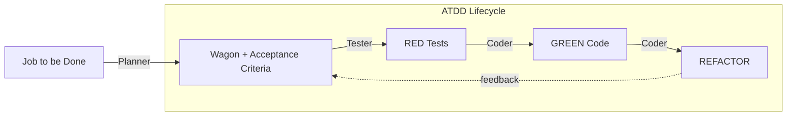

# ATDD

Acceptance Test Driven Development toolkit for structured planning and convention enforcement.

ATDD covers the full software lifecycle, not just code. It starts from a job to be done (e.g., user problem or goal), turns it into deterministic requirements, validates them with tests, and then drives implementation.



## Installation

### From PyPI

```bash
pip install atdd
```

### Upgrade

```bash
pip install --upgrade atdd
```

### Uninstall (Consumer Repos)

If you want to remove ATDD entirely:

1. Uninstall the package:
   ```bash
   python -m pip uninstall atdd
   ```
2. Manually delete ATDD artifacts in the repo:
   ```text
   .atdd/
   Managed blocks in CLAUDE.md, AGENTS.md, etc.
   ```

Uninstalling ATDD does not remove or revert any repo files.

### For Development

```bash
git clone https://github.com/afokapu/atdd.git
cd atdd
pip install -e ".[dev]"
atdd --help
```

## Quick Start

```bash
atdd init                      # Initialize ATDD + GitHub infrastructure
atdd gate                      # START EVERY SESSION WITH THIS
atdd new <slug>                # Create GitHub issue + WMBT sub-issues
atdd sync                      # Sync rules to agent config files
atdd validate                  # Run all validators
```

> **`atdd gate` is required.**
> Tell your agent: "Run `atdd gate` and follow ATDD rigorously."
> Agents skip instruction files but can't ignore tool output. No gate = no guarantees.

## What It Does

ATDD provides:

1. **Issue Tracking** - GitHub Issues + Project v2 custom fields as source of truth
2. **Convention Enforcement** - YAML-based conventions validated via pytest
3. **ATDD Lifecycle** - Planner → Tester → Coder phase gates with state machine transitions
4. **Agent Config Sync** - Keep ATDD rules in sync across AI agent config files
5. **Design System Compliance** - Hierarchy, token, and adoption validators for frontend

## Commands

### Project Initialization

```bash
atdd init              # Bootstrap .atdd/, GitHub labels, Project v2 fields, CLAUDE.md
atdd init --force      # Reinitialize (overwrites existing)
```

Creates:
```
your-project/
├── CLAUDE.md              # With managed ATDD block
└── .atdd/
    ├── manifest.yaml      # Issue tracking
    └── config.yaml        # Agent sync + release configuration
```

Also sets up on GitHub:
- Labels: `atdd-issue`, `atdd-wmbt`, `atdd:RED`, `atdd:GREEN`, `atdd:REFACTOR`, archetype labels
- Project v2 custom fields: `ATDD:Status`, `ATDD:Train`, `ATDD:Archetypes`, etc.

### Issue Management

Issues are the source of truth, backed by GitHub Issues with Project v2 custom fields.

```bash
atdd new <slug>                              # Create parent issue + WMBT sub-issues
atdd new <slug> --archetypes be,contracts    # Specify archetypes
atdd new <slug> --train <id>                 # Assign to train
atdd list                                    # List all issues
atdd update <N> --status <STATUS>            # Update status (swaps labels automatically)
atdd update <N> --status COMPLETE --train <id>  # COMPLETE runs gate tests, artifact + release verification
atdd update <N> --status COMPLETE --force   # Bypass gate/artifact/release checks (train still enforced)
atdd close-wmbt <N> <WMBT_ID>               # Close a WMBT sub-issue
atdd archive <N>                             # Close parent + all sub-issues
```

**State machine transitions:**
```
INIT → PLANNED → RED → GREEN → REFACTOR → COMPLETE
         ↕         ↕      ↕        ↕
       BLOCKED   BLOCKED BLOCKED  BLOCKED → OBSOLETE
```

**Archetypes:** `db`, `be`, `fe`, `contracts`, `wmbt`, `wagon`, `train`, `telemetry`, `migrations`

Each archetype includes gate tests in the issue template (e.g., `fe` issues get GT-020 for TypeScript architecture and GT-021 for design system compliance).

### Agent Config Sync

Sync ATDD rules to agent config files using managed blocks that preserve user content:

```bash
atdd sync                  # Sync all enabled agents from config
atdd sync --agent claude   # Sync specific agent only
atdd sync --verify         # Check if files are in sync (for CI)
atdd sync --status         # Show sync status for all agents
```

Supported agents:
| Agent | File |
|-------|------|
| claude | CLAUDE.md |
| codex | AGENTS.md |
| gemini | GEMINI.md |
| qwen | QWEN.md |

Configure which agents to sync in `.atdd/config.yaml`:
```yaml
version: "1.0"
sync:
  agents:
    - claude      # Enabled by default
    # - codex     # Uncomment to sync AGENTS.md
    # - gemini    # Uncomment to sync GEMINI.md
    # - qwen      # Uncomment to sync QWEN.md
```

### ATDD Gate (Bootstrap Protocol)

Agents often skip instruction files. The gate solves this by injecting rules via mandatory tool output.

```bash
atdd gate              # Show gate verification info
atdd gate --json       # Output as JSON
```

**Protocol:**
1. Run `atdd gate` first
2. Agent must confirm: which files were loaded, the reported hash, key constraints
3. If files are missing/unsynced: run `atdd sync` then `atdd gate` again

**Why this works:** Gate output is mandatory tool output — agent can't ignore it. Proves which ATDD files were actually loaded and forces consistency across all agents.

### Validation

Four validator phases matching the ATDD lifecycle:

```bash
atdd validate              # Run all validators (two-stage: fast then platform)
atdd validate planner      # Planning validators (wagons, trains, URNs, WMBTs)
atdd validate tester       # Testing validators (contracts, telemetry, test naming)
atdd validate coder        # Implementation validators (architecture, boundaries, design system)
atdd validate coach        # Coach validators (issues, registries, release, gate completion)
atdd validate --quick      # Fast smoke test
atdd validate --no-split   # Single-pass execution (skip two-stage split)
atdd validate --coverage   # With coverage report
atdd validate --html       # With HTML report
```

By default, `atdd validate` runs in two stages: fast file-parsing tests in parallel, then API-bound platform tests sequentially with shared session fixtures.

### Release Versioning

ATDD enforces release versioning via coach validators. Configure the version file and tag prefix in `.atdd/config.yaml`:

```yaml
release:
  version_file: "pyproject.toml"   # or package.json, VERSION, etc.
  tag_prefix: "v"
```

Validation (`atdd validate coach`) requires:
- Version file exists and contains a version
- Git tag on HEAD matches `{tag_prefix}{version}`

### URN Graph UI

Visualize URN traceability as an interactive graph with search, family filters, and node inspection.

```bash
pip install atdd[viz]
atdd urn viz                           # Launch on default port 8502
atdd urn viz --port 9000               # Custom port
atdd urn viz --root wagon:my-wagon     # Subgraph from root
atdd urn viz --family wagon --family feature  # Filter families
```

### Other Commands

```bash
atdd status                    # Platform status
atdd inventory                 # Generate artifact inventory
atdd inventory --format json   # Inventory as JSON
atdd registry update           # Update all registries
atdd --help                    # Full help
```

## Project Structure

```
src/atdd/
├── cli.py                 # Entry point
├── coach/
│   ├── commands/          # CLI command implementations (issue.py, initializer.py, sync.py, gate.py)
│   ├── conventions/       # Coach conventions (issue.convention.yaml)
│   ├── overlays/          # Agent-specific additions
│   ├── schemas/           # JSON schemas (config, project fields, label taxonomy)
│   ├── templates/         # Issue templates, ATDD.md
│   ├── utils/             # Graph builder, URN resolver, repo utilities
│   └── validators/        # Coach validators (issues, registries, release, traceability)
├── planner/
│   ├── conventions/       # Planning conventions
│   ├── schemas/           # Planning schemas
│   └── validators/        # Planning validators
├── tester/
│   ├── conventions/       # Testing conventions
│   ├── schemas/           # Testing schemas
│   └── validators/        # Testing validators
└── coder/
    ├── conventions/       # Coding conventions (architecture, design system, boundaries)
    ├── schemas/           # Coder schemas
    └── validators/        # Implementation validators (architecture, design system compliance)
```

## Development

### Setup

```bash
git clone https://github.com/afokapu/atdd.git
cd atdd
pip install -e ".[dev]"
```

### Run Tests

```bash
# All validators from source
PYTHONPATH=src python3 -m pytest src/atdd/ -v

# Specific phase
PYTHONPATH=src python3 -m pytest src/atdd/planner/validators/ -v

# With coverage
PYTHONPATH=src python3 -m pytest --cov=atdd --cov-report=html
```

### Adding Validators

1. Create `src/atdd/{phase}/validators/test_{name}.py`
2. Write pytest test functions with `@pytest.mark.{phase}` marker
3. Run `atdd validate {phase}`

Validators are auto-discovered by pytest.

### Adding Conventions

1. Create `src/atdd/{phase}/conventions/{name}.convention.yaml`
2. Reference in validators via `Path(__file__).parent.parent / "conventions" / "..."`

## Requirements

- Python 3.10+
- pyyaml, jsonschema
- `gh` CLI (authenticated, with `project` scope for issue management)

Dev dependencies: pytest, pytest-xdist, pytest-html

## License

MIT
