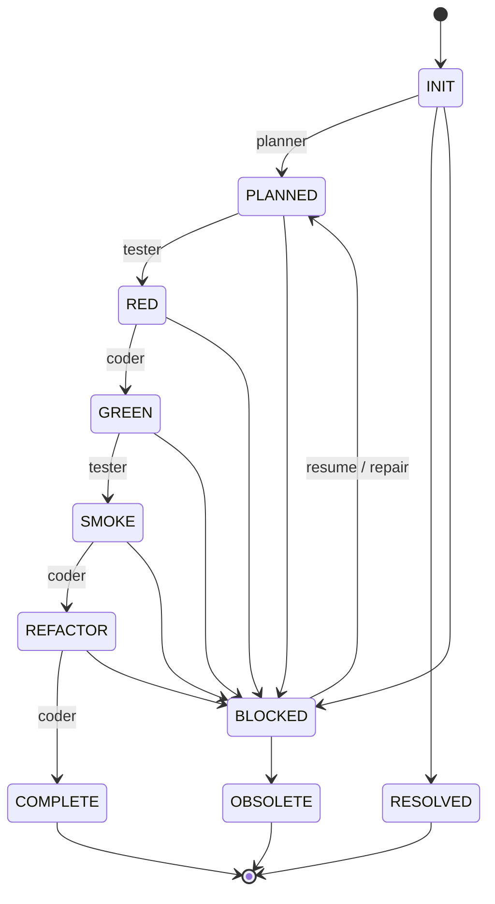

# ATDD

[](https://pypi.org/project/atdd/) [](https://github.com/afokapu/atdd/actions) [](#license)

> **Agentic Train Driven Development** — agents move a work item through an evidence-gated lifecycle, one phase at a time, and may not advance without producing the evidence that phase owes.

## Key concepts

- **Train** — the durable route a work item takes from intent to merge: scope, WMBTs, acceptance claims, phase evidence, dependencies.
- **Phase** — a station on that route. Each phase declares the persona that drives it, the phases it may move to, and a pre-commit gate. The phase machine in `src/atdd/coach/conventions/phase_machine.convention.yaml` is the single source of truth; everything else projects from it.
- **Persona** — `planner`, `tester`, `coder`, or `coach`. One persona drives each phase.
- **Autonomy** — who may *submit* a phase's forward transition. `agent` means the persona submits it unattended; `operator` reserves it for human sign-off. Entering an escape (`BLOCKED`, `OBSOLETE`) is never autonomous.
- **Convention** — a rule carrying a canonical rule ID, a severity, and a disposition. Validators bind to rule IDs, so a report always names the rule it violated.
- **Disposition** — what a violation costs: `strict` fails CI, `suppress-and-clean` lets pre-existing sites carry deadline suppressions while new violations fail, `advisory` warns, `documentation-only` is dispatched by the coach runtime rather than a validator.
- **Substrate** — the installed extensions and workspaces a repo validates against, tracked in `.atdd/substrate.lock.yaml` and `.atdd/binding.lock.yaml`.

## Lifecycle


```mermaid
stateDiagram-v2
    [*] --> INIT
    INIT --> PLANNED: planner
    PLANNED --> RED: tester
    RED --> GREEN: coder
    GREEN --> SMOKE: tester
    SMOKE --> REFACTOR: coder
    REFACTOR --> COMPLETE: coder
    INIT --> RESOLVED
    INIT --> BLOCKED
    PLANNED --> BLOCKED
    RED --> BLOCKED
    GREEN --> BLOCKED
    SMOKE --> BLOCKED
    REFACTOR --> BLOCKED
    BLOCKED --> PLANNED: resume / repair
    BLOCKED --> OBSOLETE
    COMPLETE --> [*]
    RESOLVED --> [*]
    OBSOLETE --> [*]
```

| Phase | Persona | Deliverable | Autonomy | Pre-commit gate |
|---|---|---|---|---|
| `INIT` | planner | wagon + WMBTs + acceptance | operator | `atdd validate planner` |
| `PLANNED` | tester | RED tests from acceptance | operator | `atdd validate tester` |
| `RED` | coder | GREEN implementation | agent | `atdd validate coder` |
| `GREEN` | tester | SMOKE evidence against real wiring | agent | `atdd validate tester` |
| `SMOKE` | coder | refactor to intended architecture | agent | `atdd validate coder` |
| `REFACTOR` | coder | merge readiness | operator | `atdd validate coach` |
| `COMPLETE` | — | terminal: shipped | — | — |

Three states sit off the spine. `BLOCKED` is a resumable escape, entered and left by operator decision. `RESOLVED` is success without code — an umbrella that investigated a problem and saw its children merge. `OBSOLETE` is retirement. All are terminal except `BLOCKED`.

## Quick start

```bash
pipx install atdd                                       # isolated from project Python
atdd init                                               # bootstrap .atdd/ + GitHub infrastructure
atdd gate                                               # start every agent session with this
```

Plan first. `atdd plan` is a gated, on-disk decomposition session running **Intent → Attach → Compose → Ratify → author**. Nothing is written until the operator ratifies.

```bash
atdd plan start      --id my-feature --main-job "What job is to be done?"   # Intent
atdd plan advance    --id my-feature --step attach
atdd plan source     --id my-feature "docs/spec.md + repo context"
atdd plan advance    --id my-feature --step compose
atdd plan unit       --id my-feature --kind wagon --ref my-wagon --spec '{...}'
atdd plan advance    --id my-feature --step ratify
atdd plan decide     --id my-feature --ref my-wagon --verdict keep
atdd author issue    --title "..." --slug my-feature     # store-first issue + WMBT sub-issues
atdd plan bind-issue --id my-feature --issue my-feature  # a local slug, not a GitHub number
atdd plan ratify     --id my-feature                     # the confirm-before-author boundary
atdd plan author     --id my-feature                     # authors each kept unit via `atdd author`
```

Then drive the work:

```bash
atdd worktree create <N>                                # worktree + draft PR
atdd coach <N>                                          # drive the issue through the lifecycle
atdd coach status --watch                               # inspect a running session
atdd validate                                           # run validators
atdd pr <N>                                             # open / promote PR
```

> **Issue and PR creation go through `atdd`.** Direct `gh issue create` / `gh pr create` bypass store-first work-item creation, manifest registration, WMBT sub-issues, and the branch/merge guards.

## Commands

Run `atdd --help`, or `atdd <command> --help`, for the authoritative surface.

| Command | Purpose |
|---|---|
| `atdd gate` | mandatory tool-output bootstrap for an agent session |
| `atdd plan` | gated decomposition session (`start`/`source`/`unit`/`decide`/`ratify`/`author`/`reopen`) |
| `atdd author` | author schema-valid substrate and plan artifacts by construction |
| `atdd coach` | durable per-issue orchestrator; also `transition`, `check`, `close-wmbt`, `issues`, `reconcile`, `status` |
| `atdd worktree` | create / list / relocate / gc worktrees |
| `atdd pr` | create or promote a PR linked to an ATDD issue |
| `atdd validate` | run validators (`planner`/`tester`/`coder`/`coach`/`package`) |
| `atdd enforce` | enforce the bound substrate over consumer code |
| `atdd substrate` | admit / bind / inspect extensions and workspaces |
| `atdd rules` | inspect the merged rule registry (`show`/`where`/`grep`/`disposition`) |
| `atdd repo` | URN traceability graph, orphan and declaration analysis, `viz` |
| `atdd state` | local operational data store |
| `atdd sync` | refresh hooks, gitignore entries, exported schemas, toolkit stamp |
| `atdd doctor` | diagnose the install and hook interpreter |
| `atdd merge-cascade` | wave-ordered PR merge with CI gating |

Deprecated aliases still work but print a notice: `atdd branch` → `atdd worktree create`, and the flat `atdd add`/`remove`/`bind`/`capabilities` → `atdd substrate <verb>`.

## Installation

```bash
pipx install atdd            # recommended; isolates ATDD from project Python
pipx install atdd[viz]       # with visualization extras
pip install atdd             # alternative
```

Development:

```bash
git clone https://github.com/afokapu/atdd.git
cd atdd && pip install -e ".[dev]" && atdd --help
```

To remove from a consumer repo: `pip uninstall atdd`, then delete `.atdd/`.

## Requirements

Python 3.10+, and `gh` authenticated with repo scope. A multiplexer (cmux, zellij, or tmux) is optional, for visual parallel runs.

## Documentation

| Doc | Purpose |
|---|---|
| [`docs/validators.md`](docs/validators.md) | validator phases, rule IDs, dispositions |
| [`docs/extensions.md`](docs/extensions.md) | extension-first architecture and migration |
| [`docs/releasing.md`](docs/releasing.md) | version bump, tagging, PyPI publishing |
| [`CONTRIBUTING.md`](CONTRIBUTING.md) | running tests, adding validators and conventions |
| [`docs/coach-decomposition.md`](docs/coach-decomposition.md) | Coach decomposition: source of truth |
| [`docs/coach-worked-example.md`](docs/coach-worked-example.md) | end-to-end worked example |
| [`docs/MODELS.md`](docs/MODELS.md) | worker-model selection |
| `src/atdd/*/conventions/` | machine-readable rule definitions |

## License

MIT
