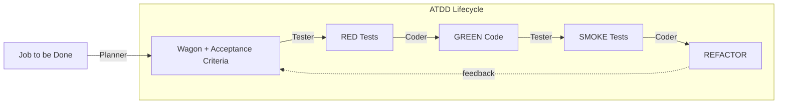

# ATDD

Acceptance Test Driven Development toolkit for structured planning and convention enforcement.

ATDD covers the full software lifecycle, not just code. It starts from a job to be done (e.g., user problem or goal), turns it into deterministic requirements, validates them with tests, and then drives implementation.


```mermaid
flowchart LR
    A[Job to be Done] -->|Planner| B[Wagon + Acceptance Criteria]
    B -->|Tester| C[RED Tests]
    C -->|Coder| D[GREEN Code]
    D -->|Tester| F[SMOKE Tests]
    F -->|Coder| E[REFACTOR]
    E -.->|feedback| B

    subgraph "ATDD Lifecycle"
        B
        C
        D
        F
        E
    end
```

## Installation

### From PyPI

```bash
pip install atdd
```

### Upgrade

```bash
pip install --upgrade atdd
```

### Uninstall (Consumer Repos)

If you want to remove ATDD entirely:

1. Uninstall the package:
   ```bash
   python -m pip uninstall atdd
   ```
2. Manually delete ATDD artifacts in the repo:
   ```text
   .atdd/
   Managed blocks in CLAUDE.md, AGENTS.md, etc.
   ```

Uninstalling ATDD does not remove or revert any repo files.

### For Development

```bash
git clone https://github.com/afokapu/atdd.git
cd atdd
pip install -e ".[dev]"
atdd --help
```

## Quick Start

```bash
atdd init                      # Initialize ATDD + GitHub infrastructure
atdd gate                      # START EVERY SESSION WITH THIS
atdd issue <slug>              # Create GitHub issue + WMBT sub-issues
atdd branch <N>                # Create worktree branch from issue (auto-creates draft PR)
atdd pr <N>                    # Open / promote PR linked to issue (closing keywords)
atdd sync                      # Sync rules to agent config files
atdd validate                  # Run all validators
atdd upgrade                   # Pull latest atdd from PyPI, then sync + init --force
```

> **All issue/PR creation must go through the `atdd` CLI.**
> `gh issue create` / `gh pr create` bypass manifest registration, WMBT
> generation, and Project v2 field setup. The coach validator flags these.

> **`atdd gate` is required.**
> Tell your agent: "Run `atdd gate` and follow ATDD rigorously."
> Agents skip instruction files but can't ignore tool output. No gate = no guarantees.

## What It Does

ATDD provides:

1. **Issue Tracking** - GitHub Issues + Project v2 custom fields as source of truth
2. **Convention Enforcement** - YAML-based conventions validated via pytest
3. **ATDD Lifecycle** - Planner → Tester → Coder phase gates with state machine transitions
4. **Agent Config Sync** - Keep ATDD rules in sync across AI agent config files
5. **Design System Compliance** - Hierarchy, token, and adoption validators for frontend

## Commands

### Project Initialization

```bash
atdd init                    # Bootstrap .atdd/, GitHub labels, Project v2 fields, CLAUDE.md
atdd init --force            # Reinitialize (overwrites existing)
atdd init --export-schemas   # Also export convention schemas to consumer repo
```

Creates:
```
your-project/
├── CLAUDE.md              # With managed ATDD block
└── .atdd/
    ├── manifest.yaml      # Issue tracking
    ├── config.yaml        # Agent sync + release + code roots + themes
    ├── baselines/         # Ratchet baselines per validator phase
    └── hooks/             # Advisory pre-commit / pre-push hooks
```

Also sets up on GitHub:
- Labels: `atdd-issue`, `atdd-wmbt`, `atdd:RED`, `atdd:GREEN`, `atdd:SMOKE`, `atdd:REFACTOR`, archetype labels
- Project v2 custom fields: `ATDD:Status`, `ATDD:Train`, `ATDD:Archetypes`, etc.

### Worktree Layout

Migrate your repo to a flat-sibling worktree layout where each branch lives alongside `main/`:

```bash
atdd init --worktree-layout         # Migrate repo into main/ subdirectory
atdd init --worktree-layout --force # Non-interactive
```

Resulting structure:
```
your-project/
├── your-project.code-workspace   # VS Code multi-root workspace (auto-generated)
├── main/                         # Primary checkout
├── feat-some-feature/            # git worktree: feat/some-feature
└── fix-login-bug/                # git worktree: fix/login-bug
```

Creating and removing worktrees:
```bash
cd main
git worktree add ../feat-my-feature -b feat/my-feature   # New branch
git worktree remove ../feat-my-feature                    # After merge
```

After adding or removing worktrees, run `atdd sync` to refresh the workspace file:
```bash
atdd sync   # Regenerates .code-workspace with current worktrees
```

#### Opening the Workspace

After migrating to worktree layout, **always open the `.code-workspace` file** instead of individual folders:

```bash
code your-project.code-workspace   # or: File → Open Workspace from File…
```

This gives you:
- **Branch-aware sidebar** — each worktree folder shows its active branch in the Explorer
- **Git tracking per worktree** — Source Control panel tracks changes independently per branch
- **Shared settings** — editor config, extensions, and tasks apply across all worktrees
- **Auto-updated** — `atdd sync` regenerates the workspace file when worktrees are added or removed

> **Do not open `main/` directly.** Without the workspace file, VS Code won't track sibling worktrees and you lose multi-branch visibility.

### Issue Management

Issues are the source of truth, backed by GitHub Issues with Project v2 custom fields.

```bash
atdd issue <slug>                              # Create parent issue + WMBT sub-issues
atdd issue <slug> --archetypes be,contracts    # Specify archetypes
atdd issue <slug> --train <id>                 # Assign to train
atdd issue <N>                                 # Enter issue (state-driven context)
atdd issue <N> --check                         # Run template compliance check
atdd issue <N> --status <STATUS>               # Transition status (swaps labels automatically)
atdd issue <N> --status COMPLETE               # Runs gate tests, artifact + release verification
atdd issue <N> --status COMPLETE --force       # Bypass gate/artifact/release checks (train still enforced)
atdd issue <N> --close-wmbt <WMBT_ID>          # Close a WMBT sub-issue
atdd issue <N> --sync-wmbts                    # Backfill missing GitHub WMBT sub-issues from plan YAMLs
atdd issue <N> --orchestrate                   # Walk dep graph, launch atdd orchestrate on the wave
atdd issue open                                # List open issues
atdd issue sync-labels <N>                     # Re-derive labels from body metadata
atdd list                                      # List all issues (from GitHub)
```

**Branch & PR shortcuts** (mandatory — never use `gh pr create` directly):

```bash
atdd branch <N>                                  # Create worktree branch + push + draft PR
atdd pr <N>                                      # Create / open PR with closing keywords
atdd pr <N> --draft                              # Open as draft
atdd pr <N> --base develop                       # Override base branch (default: main)
atdd pr <N> --auto                               # Enable auto-merge after CI
atdd pr <N> --auto --merge-strategy rebase       # squash | merge | rebase
```

> All open issues must carry the `atdd-issue` label — `atdd issue …`
> applies it automatically. `atdd validate coach` flags any open issue
> missing it (label-compliance gate).

**State machine transitions:**
```
INIT → PLANNED → RED → GREEN → SMOKE → REFACTOR → COMPLETE
         ↕         ↕      ↕      ↕       ↕
       BLOCKED   BLOCKED BLOCKED BLOCKED BLOCKED → OBSOLETE
```

**Archetypes:** `db`, `be`, `fe`, `contracts`, `wmbt`, `wagon`, `train`, `telemetry`, `migrations`, `coach`

Each archetype includes gate tests in the issue template (e.g., `fe` issues get GT-020 for TypeScript architecture and GT-021 for design system compliance).

### Agent Config Sync

Sync ATDD rules to agent config files using managed blocks that preserve user content:

```bash
atdd sync                  # Sync all enabled agents from config
atdd sync --agent claude   # Sync specific agent only
atdd sync --verify         # Check if files are in sync (for CI)
atdd sync --status         # Show sync status for all agents
```

Supported agents:
| Agent | File |
|-------|------|
| claude | CLAUDE.md |
| codex | AGENTS.md |
| gemini | GEMINI.md |
| qwen | QWEN.md |

Configure which agents to sync in `.atdd/config.yaml`. Full schema:

```yaml
version: "1.0"

sync:
  agents:
    - claude      # Enabled by default
    # - codex     # Uncomment to sync AGENTS.md
    # - gemini    # Uncomment to sync GEMINI.md
    # - qwen      # Uncomment to sync QWEN.md

init:
  skip_workflows: false   # Set true to skip generating .github/workflows on atdd init

release:
  version_file: "pyproject.toml"   # or package.json, VERSION, etc.
  tag_prefix: "v"

# Stack roots (drives validators that need to know where each archetype lives)
code:
  python: "src"
  supabase: "supabase/functions"
  frontend: "web/src"
  toolkit: "src/atdd"   # only for the atdd toolkit-self repo

# Optional theme overrides for atdd urn viz / status output
themes:
  default: "auto"
  # custom:
  #   primary: "#0ea5e9"
  #   accent: "#22c55e"
```

### ATDD Gate (Bootstrap Protocol)

Agents often skip instruction files. The gate solves this by injecting rules via mandatory tool output.

```bash
atdd gate              # Show gate verification info
atdd gate --json       # Output as JSON
```

**Protocol:**
1. Run `atdd gate` first
2. Agent must confirm: which files were loaded, the reported hash, key constraints
3. If files are missing/unsynced: run `atdd sync` then `atdd gate` again

**Why this works:** Gate output is mandatory tool output — agent can't ignore it. Proves which ATDD files were actually loaded and forces consistency across all agents.

### Validation

Four validator phases matching the ATDD lifecycle:

```bash
atdd validate                  # Run all validators (two-stage: fast then platform)
atdd validate planner          # Planning validators (wagons, trains, URNs, WMBTs)
atdd validate tester           # Testing validators (contracts, telemetry, test naming, smoke coverage)
atdd validate coder            # Implementation validators — see coverage list below
atdd validate coach            # Coach validators (issues, registries, release, gate completion, label compliance)
atdd validate --quick          # Fast smoke test
atdd validate --no-split       # Single-pass execution (skip two-stage split)
atdd validate --skip-api       # Skip github_api-marked validators (offline mode)
atdd validate --verify-baseline  # Fail if any ratchet baseline drifts from .atdd/baselines/
atdd validate --coverage       # With coverage report
atdd validate --html           # With HTML report
```

By default, `atdd validate` runs in two stages: fast file-parsing tests in parallel, then API-bound platform tests sequentially with shared session fixtures.

**Coder validator coverage:** 4-layer architecture, wagon boundaries, design system hierarchy, structured logging, security patterns, error responses, N+1 queries, cognitive complexity, dead code (Python + TypeScript), code duplication, contract-driven HTTP (no raw `fetch()`), and train-driven frontend composition.

### Release Versioning

ATDD enforces release versioning via coach validators. Configure the version file and tag prefix in `.atdd/config.yaml`:

```yaml
release:
  version_file: "pyproject.toml"   # or package.json, VERSION, etc.
  tag_prefix: "v"
```

Validation (`atdd validate coach`) requires:
- Version file exists and contains a version
- Git tag on HEAD matches `{tag_prefix}{version}`

### CI Release Workflow

`atdd init` generates three GitHub Actions workflows:

| Workflow | Trigger | Purpose |
|----------|---------|---------|
| `atdd-validate.yml` | push, PR, issues | Run ATDD validators |
| `publish.yml` | `workflow_run` (after validate succeeds on main) | Tag + publish |
| `post-merge-lifecycle.yml` | `pull_request` closed (merged) | Auto-close WMBT sub-issues, transition parent issue to `atdd:COMPLETE` |

**Release flow:**
1. Agent bumps version on PR branch (feat/ → MINOR, fix/ → PATCH)
2. PR merges to main
3. `atdd-validate.yml` runs validators
4. `publish.yml` triggers automatically: reads version → creates git tag → publishes

**Consumer repos** get tag creation out of the box. To add platform-specific publishing (PyPI, npm, Docker), extend the generated `publish.yml` with your own publish steps. See the [atdd toolkit's publish.yml](.github/workflows/publish.yml) as a PyPI example.

### URN Graph UI

Visualize URN traceability as an interactive graph with search, family filters, and node inspection.

```bash
pip install atdd[viz]
atdd urn viz                           # Launch on default port 8502
atdd urn viz --port 9000               # Custom port
atdd urn viz --root wagon:my-wagon     # Subgraph from root
atdd urn viz --family wagon --family feature  # Filter families
atdd urn viz --mode journey            # Journey mode — TRAIN_STEP edges from train sequence[]
```

### Parallel Orchestration

Run multiple agent sessions in parallel — one issue per worktree, each in its
own multiplexer workspace — with a babysitter that auto-approves known-safe
prompts and escalates the rest. See `src/atdd/coach/conventions/orchestration.convention.yaml`.

```bash
atdd session-template <N>                            # Generate launch script from issue body
atdd orchestrate <N1> <N2> ...                       # Wave-ordered parallel launch
atdd orchestrate <N> --autonomous                    # Allow sessions past REFACTOR without confirmation
atdd orchestrate <N> --resume                        # Resume from .atdd/orchestrate-state.json
atdd orchestrate <N> --dry-run                       # Print waves without creating worktrees
atdd orchestrate <N> --multiplexer cmux|zellij|tmux  # Force backend (default: auto-detect)
atdd babysit                                         # Watch all sessions, auto-approve safe prompts
atdd babysit --interval 30 --once                    # One screen-read cycle and exit
atdd babysit --workspaces ws1,ws2 --stale-warn 10 --stale-escalate 20
atdd merge-cascade <pr1> <pr2> ...                   # Wave-ordered merge with CI gating
```

**Supported multiplexers** (auto-detected; precedence cmux > zellij > tmux):

| Backend | Workspace model | Detached creation |
|---------|-----------------|-------------------|
| cmux    | Native workspaces (preferred — matches ATDD model)  | `cmux new-workspace` |
| zellij  | Sessions targeted via `ZELLIJ_SESSION_NAME`         | `zellij attach --create-background` |
| tmux    | Sessions                                            | `tmux new-session -d` |

### Baselines (Ratchet System)

Coder validators record baseline violation counts so existing debt is
tolerated but regressions fail CI. Baselines live in
`.atdd/baselines/coder.yaml` and are committed to the repo.

```bash
atdd baseline show                # Print current baselines per validator
atdd baseline update              # Re-seed baselines from current state (commit the change)
atdd validate --verify-baseline   # Fail if any validator drifts above its baseline
```

Baselines are auto-seeded on first run of an affected validator. After
seeding, commit `.atdd/baselines/coder.yaml` to lock in the ceiling.

### Upgrading

```bash
atdd upgrade                   # Query PyPI, pip-upgrade if newer, then atdd sync + atdd init --force
```

After any successful `atdd ...` invocation that detects a version bump,
the toolkit auto-runs `atdd sync` so agent config files (CLAUDE.md,
AGENTS.md, etc.) stay aligned with the installed version.

### Other Commands

```bash
atdd status                    # Platform status
atdd inventory                 # Generate artifact inventory
atdd inventory --format json   # Inventory as JSON
atdd inventory --trace         # Unified URN traceability matrix report
atdd registry update           # Update all registries
atdd --help                    # Full help
```

## Project Structure

```
src/atdd/
├── cli.py                 # Entry point
├── coach/
│   ├── commands/          # CLI command implementations (issue.py, initializer.py, sync.py, gate.py)
│   ├── conventions/       # Coach conventions (issue.convention.yaml)
│   ├── overlays/          # Agent-specific additions
│   ├── schemas/           # JSON schemas (config, project fields, label taxonomy)
│   ├── templates/         # Issue templates, ATDD.md
│   ├── utils/             # Graph builder, URN resolver, repo utilities
│   └── validators/        # Coach validators (issues, registries, release, traceability)
├── planner/
│   ├── conventions/       # Planning conventions
│   ├── schemas/           # Planning schemas
│   └── validators/        # Planning validators
├── tester/
│   ├── conventions/       # Testing conventions
│   ├── schemas/           # Testing schemas
│   └── validators/        # Testing validators
└── coder/
    ├── conventions/       # Coding conventions (architecture, design system, boundaries)
    ├── schemas/           # Coder schemas
    └── validators/        # Implementation validators (architecture, design system compliance)
```

## Development

### Setup

```bash
git clone https://github.com/afokapu/atdd.git
cd atdd
pip install -e ".[dev]"
```

### Run Tests

```bash
# All validators from source
PYTHONPATH=src python3 -m pytest src/atdd/ -v

# Specific phase
PYTHONPATH=src python3 -m pytest src/atdd/planner/validators/ -v

# With coverage
PYTHONPATH=src python3 -m pytest --cov=atdd --cov-report=html
```

### Adding Validators

1. Create `src/atdd/{phase}/validators/test_{name}.py`
2. Write pytest test functions with `@pytest.mark.{phase}` marker
3. Run `atdd validate {phase}`

Validators are auto-discovered by pytest.

### Adding Conventions

1. Create `src/atdd/{phase}/conventions/{name}.convention.yaml`
2. Reference in validators via `Path(__file__).parent.parent / "conventions" / "..."`

## Requirements

- Python 3.10+
- pyyaml, jsonschema
- `gh` CLI (authenticated, with `project` scope for issue management)
- One of `cmux`, `zellij`, or `tmux` — only required for `atdd orchestrate` / `atdd babysit`

**Optional environment variables:**

| Var | Default | Effect |
|-----|---------|--------|
| `ATDD_MAX_UNCOMMITTED` | 10 | Threshold for the pre-push micro-commit warning |
| `ATDD_MAX_STAGED` | 20 | Threshold for the pre-commit micro-commit warning |

Dev dependencies: pytest, pytest-xdist, pytest-html

## License

MIT
