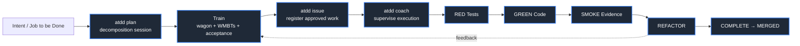
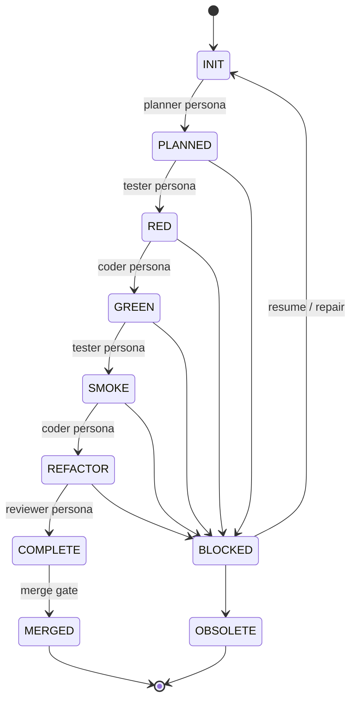
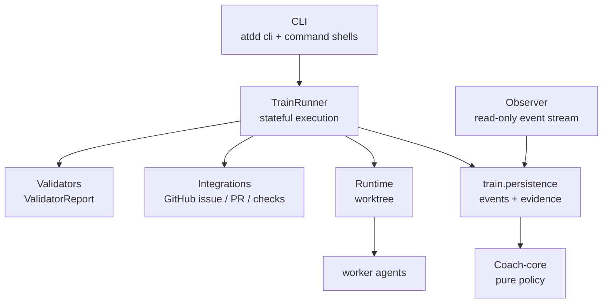
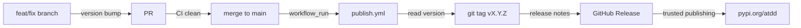

# ATDD

[](https://pypi.org/project/atdd/) [](https://github.com/afokapu/atdd/actions) [](#license)

> **Agentic Train Driven Development** — a toolkit for turning intent into evidence-gated trains of work, then using agents to plan, test, implement, validate, review, and merge one safe step at a time.

ATDD gives AI agents a track. Instead of asking an agent to “build the feature,” ATDD turns the work into a train: a route, stops, evidence gates, validation rules, and clear handoffs between planning, testing, implementation, smoke verification, refactor, and merge.


```mermaid
flowchart LR
    A[Intent / Job to be Done] --> P[atdd plan<br/>decomposition session]
    P --> T[Train<br/>wagon + WMBTs + acceptance]
    T --> I[atdd issue<br/>register approved work]
    I --> C[atdd coach<br/>supervise execution]
    C --> R[RED Tests]
    R --> G[GREEN Code]
    G --> S[SMOKE Evidence]
    S --> F[REFACTOR]
    F --> M[COMPLETE → MERGED]
    F -.->|feedback| T
    classDef phase fill:#1f2937,color:#fff,stroke:#3b82f6,stroke-width:2px
    class P,T,I,C,R,G,S,F,M phase
```

**Jump to:** [What ATDD means](#what-atdd-means) · [Quick Start](#quick-start) · [Core concepts](#core-concepts) · [Consumer repos](#consumer-repos) · [Commands](#commands) · [Lifecycle](#the-atdd-lifecycle) · [Architecture direction](#architecture-direction) · [Validators](#validators) · [Installation](#installation)

---

## What ATDD means

ATDD now means **Agentic Train Driven Development**.

For a layperson:

- **Agentic** means AI agents do real work, but inside clear boundaries.
- **Train** means the work has a route: phases, dependencies, evidence, gates, and a definition of done.
- **Development** means the route ends in shipped, reviewed, validated changes.

A train is not just a list of tasks. It is the structured path from intent to merged work.

| Train metaphor | ATDD meaning |
|---|---|
| Route | planned path from intent to implementation |
| Stations | phases such as PLANNED, RED, GREEN, SMOKE, REFACTOR |
| Cargo | the feature, fix, refactor, or planning artifact being delivered |
| Tickets | WMBTs, acceptance claims, rule IDs, and evidence requirements |
| Signals | validators, CI, review verdicts, smoke evidence |
| Conductor | Coach / operator supervision |
| Train runner | the execution engine that drives the train over time |
| Logbook | events.jsonl, decisions.jsonl, validator reports |

In short:

> ATDD turns ambiguous work into an evidence-gated train, then lets agents move through that train safely.

---

## Why ATDD

| You want to… | ATDD gives you… |
|---|---|
| stop agents skipping instructions | `atdd gate` — coercive mandatory tool-output bootstrap |
| turn vague intent into executable structure | `atdd plan` — a gated decomposition session (Intent→Attach→Compose→Ratify→author) |
| keep planning, testing, and code in lock-step | a deterministic lifecycle: `INIT → PLANNED → RED → GREEN → SMOKE → REFACTOR → COMPLETE → MERGED` |
| run multiple agents without merge chaos | `atdd coach` + worktrees + per-issue runtime isolation |
| recover from interrupted work | JSONL event logs and resumable train runs *(decomposition target)* |
| catch regressions before review | validators + per-rule dispositions + rule-ID binding |
| sync rules across Claude, Codex, Gemini, GLM | `atdd sync` — managed blocks that preserve user content |
| treat issues, PRs, plan artifacts, and releases as one system | GitHub Issues + `atdd:<phase>` labels + manifest + release gates |

---

## Quick Start

```bash
pipx install atdd                         # Install, isolated from project Python
atdd init                                 # Bootstrap .atdd/ + GitHub infrastructure
atdd gate                                 # Start every agent session with this

# Current registration/execution flow
atdd issue my-new-feature                 # Create parent issue + WMBT sub-issues
atdd branch <N>                           # Create worktree + draft PR
atdd coach <N>                            # Drive issue through the lifecycle
atdd validate                             # Run validators
```

Planning-first flow via the gated `atdd plan` session:

```bash
atdd plan start --id my-plan --main-job "What job is to be done?"
atdd plan advance --id my-plan --step attach
atdd plan source  --id my-plan "docs/spec.md + repo context"
atdd plan advance --id my-plan --step compose
atdd plan unit    --id my-plan --kind wagon --ref my-wagon --spec '{...}'
atdd plan advance --id my-plan --step ratify
atdd plan decide  --id my-plan --ref my-wagon --verdict keep
atdd plan ratify  --id my-plan        # the ratify-before-author boundary (`confirm` still works)
atdd plan author  --id my-plan        # system authors each kept unit via `atdd author`
```

> **Mandatory:** issue and PR creation go through `atdd`. Direct `gh issue create` / `gh pr create` bypass manifest registration, WMBT sub-issues, store-first work-item creation, and branch/merge guards.

---

## Core concepts

### Plan

`atdd plan` is the gated decomposition session: a durable, on-disk state machine
that runs **Intent → Attach → Compose → Ratify → author** (the LLM/agent runs the
dialogue within each stage; `atdd plan` holds the gated session state and enforces
the transitions). The stages name what the *operator* is deciding, not what the
tool is doing.

It answers:

> Given this main job, these sources, and current repo context, what decomposition should we author?

The gates:

- **Intent** — declare the JTBD main job and its boundaries (no advance without it);
- **Attach** — connect that intent to existing repository context: sources and
  current `plan/` state;
- **Compose** — arrange the proposed decomposition, each unit carrying a valid
  `atdd author` spec;
- **Ratify** — operator keep/pivot/kill approves, rejects or redirects the
  composition and locks it. This is the **confirm-before-author** boundary:
  nothing is written before the operator ratifies. (The stage is Ratify; the rule
  keeps the name `confirm-before-author`.)
- **Author** — on ratification, the system invokes `atdd author <kind>` per locked
  unit, landing schema-valid plan artifacts deterministically.

`atdd plan confirm` remains as an alias of `atdd plan ratify`.

### Train

A train is the durable domain route for work.

It contains:

- wagon and feature scope;
- WMBTs and acceptance claims;
- phase evidence requirements;
- dependencies and ordering;
- validator expectations;
- the path from planning to merge.

The train is **what should happen**.

### Coach

Coach is the supervision and policy surface.

It decides whether the train may advance, whether evidence is sufficient, whether a run should block, and whether the operator must intervene.

Coach should not be a giant runtime process. In the decomposition target, Coach-core becomes pure policy.

### TrainRunner

The TrainRunner is the execution engine.

It drives a train over time:

- creates a run;
- materializes evidence;
- asks Coach-core for a decision;
- dispatches worker agents;
- records events;
- resumes after interruption;
- handles waves and concurrency.

The first runner is local and JSONL-backed. Temporal or LangGraph are optional future backends behind the same seam, not prerequisites.

### Runtime

Runtime is where execution happens:

- worktrees;
- agent control;
- prompt delivery;
- correction inboxes;
- output logs;
- optional multiplexer views.

The multiplexer is for observability, not control. Agent control should go through structured channels such as cli-return.

---

## Consumer repos

A consumer repo should experience ATDD as a stable command surface, not as internal orchestration machinery.

Typical structure after `atdd init`:

```text
your-project/
├── main/
├── feat-some-feature/
├── CLAUDE.md
├── AGENTS.md
└── .atdd/
    ├── manifest.yaml
    ├── config.yaml
    ├── hooks/
    └── runtime/        # train-run events, agent logs, status snapshots
```

Typical consumer flow:

```bash
atdd gate
atdd plan start --id my-feature --main-job "..."               # gated decomposition session
atdd issue my-feature --type planning                          # register approved planning work
atdd branch <N>
atdd coach <N>
atdd observer
atdd validate
atdd pr <N>
```

For the consumer, the benefit is simple:

- safer worktrees;
- less fragile agent launching;
- clearer planning before issue creation;
- resumable runs;
- event logs for debugging;
- GitHub issue / PR / check-run sync;
- evidence-based phase advancement.

---

## The ATDD Lifecycle


```mermaid
stateDiagram-v2
    [*] --> INIT
    INIT --> PLANNED: planner persona
    PLANNED --> RED: tester persona
    RED --> GREEN: coder persona
    GREEN --> SMOKE: tester persona
    SMOKE --> REFACTOR: coder persona
    REFACTOR --> COMPLETE: reviewer persona
    COMPLETE --> MERGED: merge gate
    PLANNED --> BLOCKED
    RED --> BLOCKED
    GREEN --> BLOCKED
    SMOKE --> BLOCKED
    REFACTOR --> BLOCKED
    BLOCKED --> INIT: resume / repair
    BLOCKED --> OBSOLETE
    MERGED --> [*]
    OBSOLETE --> [*]
```

| State | Persona | Deliverable | Validator phase |
|---|---|---|---|
| `INIT` | planner | wagon + WMBTs + acceptance | `atdd validate planner` |
| `PLANNED` | tester | RED tests from acceptance | `atdd validate tester` |
| `RED` | coder | GREEN implementation | `atdd validate coder` |
| `GREEN` | tester | SMOKE evidence against real wiring | `atdd validate tester` |
| `SMOKE` | coder | refactor to intended architecture | `atdd validate coder` |
| `REFACTOR` | reviewer | review verdict / merge readiness | `atdd validate coach` |
| `COMPLETE` | — | PR open + CI clean | gate validators |
| `MERGED` | — | release tag + cleanup | publish workflow |

---

## Commands

### Initialization

```bash
atdd init                          # Bootstrap .atdd/ + GitHub labels + workflows
atdd init --force                  # Reinitialize managed blocks
atdd init --worktree-layout        # Migrate to flat-sibling worktree layout
atdd init --export-schemas         # Export convention schemas to consumer repo
```

### Planning

```bash
atdd plan start --id <id> --main-job "<job to be done>"
atdd plan advance --id <id> --step attach|compose|ratify
atdd plan source/unit/decide --id <id> ...
atdd plan ratify --id <id> && atdd plan author --id <id>
```

`atdd plan` is a read-only planning surface. It should render a deterministic brief and propose a train. It should not mutate GitHub, git, the manifest, or `plan/` artifacts.

### Substrate authoring (`atdd author`)

Creates schema-valid substrate artifacts **by construction** — the malformed case is impossible because every command validates role/id/path on a shared spine and the artifact against its frozen schema before any write. **Extension-first:** by default it writes into a self-contained extension package; `--core` is required (and protected) to touch the ATDD core protocol.

```bash
# extension-first (default) — writes into extensions/<publisher>.extension.<name>/
atdd author convention-node --extension acme.extension.component-header --rule-id coder.source.header-required --statement "..." --term "marker=..."
atdd author relationship    --extension acme.extension.component-header --source coder.source.a --type enables --target coder.source.b
atdd author scope           --extension acme.extension.component-header --scope-id scope.source.python --artifact-kind source_file \
                            --selector-id selector.source.python.glob --selector-type path_glob --include "src/**/*.py" --exclude ".venv/**"
atdd author gate            --extension acme.extension.component-header --gate-id gate.pre_push.x --trigger-type git_hook --trigger-name pre-push --selection blast_radius --action block

# core protocol (explicit, protected)
atdd author convention-node --core --role coach --rule-id coach.extension.manifest-has-owner-boundary --statement "..." --term "owner=..."
```

Artifact kinds and homes:

| Kind | Extension home | Core home |
|---|---|---|
| convention-node | `conventions/<rule_id>.convention.yaml` (per-file) | `src/atdd/<role>/conventions/nodes/` |
| scope (+ embedded selectors) | `scopes/<scope_id>.scope.yaml` (per-file) | `src/atdd/coach/selectors/scopes/` |
| relationship fragment | `relationships.yaml` | `src/atdd/coach/graph/relationships.yaml` |
| gate fragment | `gates/<trigger>.fragment.yaml` | `src/atdd/coach/gates/<trigger>.yaml` |

Registry-class kinds (relationship/scope/gate) use deterministic sorted-insert; concurrent inserts into the same registry resolve via a `.gitattributes`-registered re-sort/dedup git **merge driver**, so parallel authoring never produces hand-merge conflicts.

### Issue & PR

```bash
atdd issue <slug>                       # Create parent issue + WMBT sub-issues
atdd issue <slug> --type planning       # Register approved planning work
atdd issue <slug> --archetypes be,fe    # Scope touched archetypes
atdd issue <N>                          # Enter issue context
atdd issue <N> --status <STATUS>        # Transition state; auto-swaps labels
atdd issue <N> --check                  # Template compliance feedback
atdd issue <N> --sync-wmbts             # Backfill missing WMBT sub-issues
atdd issue review <N> --passes 2        # Multi-pass cross-LLM issue review

atdd branch <N>                         # Create worktree + draft PR
atdd pr <N>                             # Open / promote PR
atdd pr <N> --auto --merge-strategy squash
```

### Coach / train execution

```bash
atdd coach <N>                                 # Drive issue through lifecycle
atdd coach <N1> <N2> ...                       # Wave-ordered parallel run
atdd coach <N> --persona-llm tester=glm-5.1,coder=claude-sonnet-4-6
atdd coach <N> --review-phases planned,red,green,smoke
atdd coach <N> --skip-review
atdd coach <N> --auto-merge
atdd coach <N> --resume <run-id>
atdd coach <N> --multiplexer-mode pane
atdd coach <N> --dry-run
```

As the TrainRunner decomposition lands, `atdd resume <run-id>` becomes the explicit resume surface.

### Observer

```bash
atdd observer
atdd observer status
```

Observer is the read-only visibility surface for train events, agent output logs, and active runs.

### Validation

```bash
atdd validate
atdd validate planner
atdd validate tester
atdd validate coder
atdd validate coach
atdd validate --quick
atdd validate --coverage
atdd validate --verify-baseline
```

### Agent config sync

```bash
atdd sync
atdd sync --agent claude
atdd sync --verify
atdd sync --status
```

| Agent | Managed file |
|---|---|
| claude | `CLAUDE.md` |
| codex | `AGENTS.md` |
| gemini | `GEMINI.md` |
| glm | `GLM.md` |
| qwen | `QWEN.md` |

### Discovery & visualization

```bash
atdd rules show <rule_id>
atdd rules where <rule_id>
atdd rules grep <pattern>
atdd inventory
atdd inventory --trace
atdd repo viz
atdd repo viz --mode journey
```

### Maintenance

```bash
atdd upgrade
atdd merge-cascade <pr1> ...
atdd status
atdd registry update
```

---

## Architecture direction

ATDD is moving toward a layered train architecture:


```mermaid
flowchart TB
    CLI[CLI<br/>atdd cli + command shells] --> TR[TrainRunner<br/>stateful execution]
    TR --> PERSIST[train.persistence<br/>events + evidence]
    PERSIST --> CORE[Coach-core<br/>pure policy]
    TR --> RUNTIME[Runtime<br/>worktree]
    TR --> GH[Integrations<br/>GitHub issue / PR / checks]
    TR --> VAL[Validators<br/>ValidatorReport]
    OBS[Observer<br/>read-only event stream] --> PERSIST
    RUNTIME --> AGENT[worker agents]
```

Layer responsibilities:

| Layer | Owns | Does not own |
|---|---|---|
| `atdd.plan` | the gated decomposition session (Intent/Attach/Compose/Ratify) + on-ratify authoring via `atdd author` | issue creation, branches, PRs, merge policy |
| `atdd.train` | train model, run state, persistence, events, TrainRunner | phase policy, low-level runtime control |
| `atdd.coach.core` | pure policy: advance/block/escalate/merge readiness | I/O, subprocess, GitHub, cmux, worktrees |
| `atdd.runtime` | worktrees, agent control, multiplexer views | ATDD phase decisions |
| `atdd.integrations.github` | labels, PRs, checks | ATDD policy |
| `atdd.validators` | validation reports | orchestration decisions |
| `atdd.observer` | read-only visibility | writing orchestration state |

Temporal and LangGraph are not required to use ATDD.

- JSONL-backed TrainRunner is the default local runner.
- Temporal may become a future TrainRunner backend for cross-machine durable orchestration.
- LangGraph may become a future review/judge subgraph backend, not necessarily the whole lifecycle runner.

---

## Extension-first migration (in progress)

ATDD is migrating from a Python-centric validation toolkit into an **extensible agent-delivery protocol**: a small, protected **core** + self-contained **extension** packages for each use case, programming language, or workspace.

```text
ATDD core      = the protocol engine (schemas, lifecycle, gates, runners)
extension      = a self-contained use-case package (conventions, scopes, gate
                 fragments, validators, tests, fixtures, runtime/workspace)
workspace      = a runtime/build/test environment an extension uses
```

The guiding rule: **a use case never scatters files across core.** It is packaged as one extension that owns its substrate behind a manifest boundary, so it can be installed, indexed, and removed as a unit.

**Naming.** Packages use `<publisher>.<scope>.<artifact-name>` where scope is `core | extension`. `atdd.*` is the reserved publisher for official ATDD packages.

```text
atdd.core.*                 official core/protocol artifacts
atdd.extension.*            official ATDD extensions
<publisher>.extension.*     external/project/team extensions
```

**Where things live:**

```text
src/atdd/                      ATDD core protocol (small)
extensions/<extension-id>/     source extensions (this repo)
.atdd/extensions/<id>/<ver>/   installed extensions (consumer repo)
```

**Migration phases:**

| Phase | Scope | Status |
|---|---|---|
| 1 | substrate schemas + extension-first `atdd author` (with `--core` protection); first Python workspace extension | author wagon shipped (`atdd author`, extension-first, namespace-validated) |
| 2 | wrap existing validators in extension/implementation manifests; keep legacy paths working | next |
| 3 | new validators only via extension bundles; move mature validators into extension packages | planned |
| 4 | consumer repos install only the extensions/workspaces they need | planned |

`atdd author` is the **authoring** half (it creates compliant substrate by construction). The **packaging** half — extension/workspace/implementation manifests, install/remove, validation-flow wiring — is built as a separate wagon that *consumes* `atdd author` inside a train to assemble an extension.

Boundary recap:

```text
atdd author    creates compliant substrate artifacts  (extension by default; --core protected)
atdd substrate admits / binds / inspects the local substrate (add/remove/bind/capabilities/list)
atdd validate  verifies substrate artifacts
atdd gate      decides whether a validation failure blocks
```

### Managing the substrate — `atdd substrate`

The substrate-management verbs are grouped under one noun. `atdd substrate`
operates on the local install ledger (`.atdd/substrate.lock.yaml` +
`.atdd/binding.lock.yaml`), which covers both `atdd.extension.*` and
`atdd.workspace.*` packages:

```text
atdd substrate add <ref|--path>    admit an extension/workspace into the local substrate
atdd substrate remove <id>         withdraw an admitted artifact (refuses dependents unless --force)
atdd substrate bind [--check]      compose the runtime binding plan from the locked substrate
atdd substrate capabilities        show conventions gated by bound implementations vs legacy-fallback
atdd substrate list                list the installed substrate from the lockfile
```

The flat `atdd add` / `remove` / `bind` / `capabilities` verbs and
`atdd list --substrate` remain as **deprecated-but-working** aliases (they print
a deprecation notice pointing at the grouped form); their removal is the breaking
`4.0.0` step tracked in #1207. `atdd enforce` and `atdd validate` stay top-level
— they are the CI/operator hot path, not substrate administration.

---

## Validators

Validators map evidence to rule-bound reports. Each rule declares a canonical rule ID and disposition.

| Disposition | CI behavior |
|---|---|
| `strict` | any violation fails CI |
| `suppress-and-clean` | pre-existing sites may carry deadline suppressions; new violations fail |
| `advisory` | warnings only |

Phase coverage:

| Phase | Checks |
|---|---|
| planner | wagons, WMBTs, acceptance, train shape, URNs |
| tester | RED tests, naming, contracts, telemetry, SMOKE coverage |
| coder | architecture, boundaries, dead code, complexity, implementation evidence |
| coach | issues, registries, lifecycle, release gates, label compliance |

---

## Conventions registry

YAML conventions declare rule IDs, severities, dispositions, and fix hints.

| Domain | Conventions |
|---|---|
| planner | wagon, acceptance, WMBT, feature, artifact, decomposition protocol |
| tester | red, filename, contract, artifact, smoke |
| coder | green, refactor, boundaries, backend, frontend, design |
| coach | issue, orchestration, persona prompts, judge call-sites |
| train | phase machine, run evidence, runner events *(decomposition target)* |

Browse: `src/atdd/<phase>/conventions/*.convention.yaml`.

---

## Release & publishing


```mermaid
flowchart LR
    A[feat/fix branch] -->|version bump| B[PR]
    B -->|CI clean| C[merge to main]
    C -->|workflow_run| D[publish.yml]
    D -->|read version| E[git tag vX.Y.Z]
    E -->|release notes| F[GitHub Release]
    F -->|trusted publishing| G[pypi.org/atdd]
```

`atdd init` ships workflows for validation, release publishing, and post-merge lifecycle management.

Configure release in `.atdd/config.yaml`:

```yaml
release:
  version_file: "pyproject.toml"
  tag_prefix: "v"
```

---

## Installation

### Standard

```bash
pipx install atdd
pipx upgrade atdd
pipx install atdd[viz]
```

`pipx` keeps ATDD isolated from project Python.

### Alternative

```bash
pip install atdd
pip install --upgrade atdd
```

### Development

```bash
git clone https://github.com/afokapu/atdd.git
cd atdd && pip install -e ".[dev]"
atdd --help
```

### Uninstall from a consumer repo

```bash
python -m pip uninstall atdd
# Then manually delete .atdd/ and managed blocks in CLAUDE.md / AGENTS.md / etc.
```

---

## Project structure

Target structure as the train decomposition lands:

```text
src/atdd/
├── cli.py
├── plan/ or planner/
│   ├── commands/              # atdd plan — gated decomposition session (plan_session*.py)
│   ├── prompts/               # reusable planner fragments
│   ├── conventions/
│   ├── schemas/
│   └── validators/
├── train/
│   ├── runner_iface.py        # TrainRunner protocol
│   ├── jsonl_runner.py        # default local runner
│   ├── persistence.py         # evidence + events + resume state
│   ├── events.py
│   └── wave_runner.py
├── coach/
│   ├── core/                  # pure policy functions
│   ├── commands/              # thin public command shells
│   ├── conventions/
│   └── validators/
├── runtime/
│   └── worktree.py
├── integrations/
│   └── github/
├── tester/
└── coder/
```

Current releases may still carry some of these responsibilities under `coach/commands`; the decomposition is migrating them behind typed seams.

---

## Worker model selection

Worker agents can run on any wrapper. See `docs/MODELS.md` when available.

| Class | When to use |
|---|---|
| compliant | lifecycle work with structured prompts and fixed states |
| frontier | ambiguous design, novel planning, hard refactors |

Configure defaults in `.atdd/config.yaml`; override per invocation with `atdd coach <N> --persona-llm tester=...,coder=...`.

---

## Requirements

| | |
|---|---|
| Python | 3.10+ |
| Runtime deps | pyyaml, jsonschema |
| GitHub CLI | `gh` authenticated with required project/repo scopes |
| Multiplexer | cmux, zellij, or tmux for visual parallel runs |
| Dev deps | pytest, pytest-xdist, pytest-html |

Optional environment variables:

| Var | Effect |
|---|---|
| `ATDD_MAX_UNCOMMITTED` | pre-push micro-commit warning threshold |
| `ATDD_MAX_STAGED` | pre-commit micro-commit warning threshold |
| `ATDD_SKIP_PREPUSH_VALIDATE` | bypass pre-push validator hook when needed |

---

## Development

```bash
PYTHONPATH=src python3 -m pytest src/atdd/ -v
PYTHONPATH=src python3 -m pytest src/atdd/coder/validators/ -v
PYTHONPATH=src python3 -m pytest --cov=atdd --cov-report=html
```

Adding a validator:

1. Create `src/atdd/<phase>/validators/test_<name>.py`.
2. Bind a canonical rule ID at module import.
3. Declare the rule in the matching convention YAML.
4. Emit normalized validator reports as the train architecture lands.

Adding a convention:

1. Create `src/atdd/<phase>/conventions/<name>.convention.yaml`.
2. Declare `id`, `severity`, `disposition`, `description`, and optional `fix_hint`.
3. Reference it from validators and planning briefs.

---

## Documentation

| Doc | Purpose |
|---|---|
| `docs/coach-decomposition.md` | source of truth for Coach → TrainRunner / runtime / integrations decomposition |
| `docs/plan-decomposition.md` | proposed source of truth for standalone `atdd plan` capability |
| `atdd-plan-spec-v11.md` | planning command and brief-renderer track |
| `atdd-coach-spec-v9.md` | single-command lifecycle spec |
| `atdd-repo-substrate-spec-v12.md` | repo archetype + rule substrate |
| `docs/coach-worked-example.md` | end-to-end worked example |
| `docs/MODELS.md` | worker-model selection |
| Convention files | machine-readable rule definitions |

---

## License

MIT
