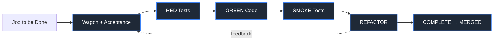
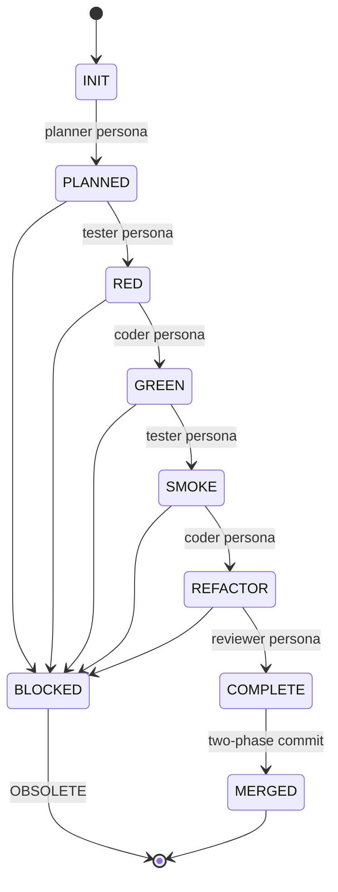
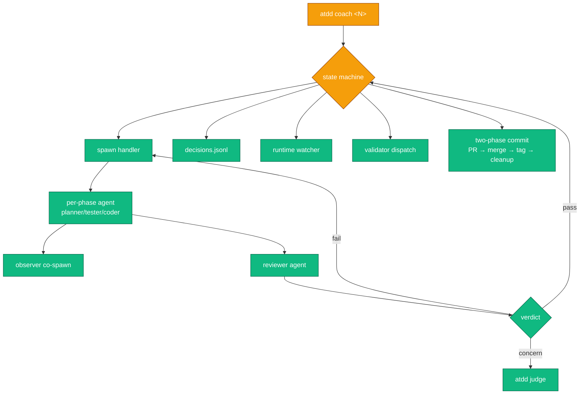
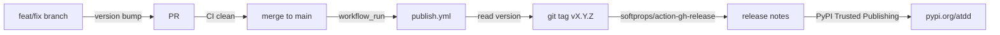

# ATDD

[](https://pypi.org/project/atdd/) [](https://github.com/afokapu/atdd/actions) [](#license)

> **Acceptance Test Driven Development toolkit** — turns a job-to-be-done into deterministic requirements, validates them with tests, and drives implementation through a structured agent lifecycle.


```mermaid
flowchart LR
    A[Job to be Done] --> B[Wagon + Acceptance]
    B --> C[RED Tests]
    C --> D[GREEN Code]
    D --> F[SMOKE Tests]
    F --> E[REFACTOR]
    E --> COMPLETE[COMPLETE → MERGED]
    E -.->|feedback| B
    classDef phase fill:#1f2937,color:#fff,stroke:#3b82f6,stroke-width:2px
    class B,C,D,F,E,COMPLETE phase
```

**Jump to:** [Quick Start](#quick-start) · [Lifecycle](#the-atdd-lifecycle) · [Multi-agent orchestration](#multi-agent-orchestration) · [Commands](#commands) · [Validators](#validators) · [Installation](#installation)

---

## Why ATDD

| You want to… | ATDD gives you… |
|---|---|
| stop agents skipping instructions | `atdd gate` — coercive mandatory tool-output bootstrap |
| keep planning, testing, and code in lock-step | a deterministic state machine: `INIT → PLANNED → RED → GREEN → SMOKE → REFACTOR → COMPLETE → MERGED` |
| run 5+ agents in parallel without merge chaos | `atdd coach` + worktrees + per-issue cmux/tmux/zellij panes |
| catch regressions before review | 4 validator phases + per-rule disposition gates + rule-ID binding |
| sync rules across Claude, Codex, Gemini, GLM | `atdd sync` — managed blocks that preserve user content |
| treat issues, PRs, and releases as one artifact | GitHub Issues + Project v2 fields + auto-tag publish.yml |

---

## Quick Start

```bash
pipx install atdd                         # Install (recommended — isolated venv)
atdd init                                 # Bootstrap .atdd/ + GitHub infrastructure
atdd gate                                 # ← START EVERY SESSION WITH THIS
atdd issue my-new-feature                 # Create parent issue + WMBT sub-issues
atdd branch <N>                           # Create worktree + draft PR
atdd coach <N>                            # Drive INIT → MERGED via state machine
atdd validate                             # Run all validators
```

> **Mandatory:** all issue & PR creation goes through `atdd`. `gh issue create` / `gh pr create` are blocked by convention. Reason: bypass loses manifest registration, WMBT sub-issues, Project v2 fields, and the `--base default-branch` orphan-merge guard.

---

## The ATDD Lifecycle


```mermaid
stateDiagram-v2
    [*] --> INIT
    INIT --> PLANNED: planner persona
    PLANNED --> RED: tester persona
    RED --> GREEN: coder persona
    GREEN --> SMOKE: tester persona
    SMOKE --> REFACTOR: coder persona
    REFACTOR --> COMPLETE: reviewer persona
    COMPLETE --> MERGED: two-phase commit
    PLANNED --> BLOCKED
    RED --> BLOCKED
    GREEN --> BLOCKED
    SMOKE --> BLOCKED
    REFACTOR --> BLOCKED
    BLOCKED --> [*]: OBSOLETE
    MERGED --> [*]
```

| State | Persona | Deliverable | Validator phase |
|---|---|---|---|
| `INIT` | planner | wagon + acceptance + WMBT | `atdd validate planner` |
| `PLANNED` | tester | RED tests from acceptance | `atdd validate tester` |
| `RED` | coder | GREEN implementation | `atdd validate coder` (green) |
| `GREEN` | tester | SMOKE tests vs real infra | `atdd validate tester` (smoke) |
| `SMOKE` | coder | REFACTOR to 4-layer arch | `atdd validate coder` (architecture) |
| `REFACTOR` | reviewer | review-report.json pass | `atdd validate coach` |
| `COMPLETE` | — | PR open + CI clean | gate validators |
| `MERGED` | — | release tag + cleanup | publish.yml |

---

## Multi-agent orchestration


```mermaid
flowchart TB
    coach["atdd coach &lt;N&gt;"] --> SM{state machine}
    SM --> SP[spawn handler]
    SM --> DEC[decisions.jsonl]
    SM --> WATCH[runtime watcher]
    SM --> VAL[validator dispatch]
    SP --> AGENT[per-phase agent<br/>planner/tester/coder]
    AGENT --> OBS[observer co-spawn]
    AGENT --> REV[reviewer agent]
    REV --> JUDGE{verdict}
    JUDGE -->|pass| SM
    JUDGE -->|concern| ATDDJUDGE[atdd judge]
    JUDGE -->|fail| SP
    SM --> TPC[two-phase commit<br/>PR → merge → tag → cleanup]
    classDef shipped fill:#10b981,color:#fff,stroke:#065f46
    classDef wip fill:#f59e0b,color:#fff,stroke:#92400e
    class AGENT,OBS,REV,JUDGE,ATDDJUDGE,TPC,DEC,WATCH,VAL,SP shipped
    class SM,coach wip
```

**Components:** all shipped via the coach-v9 train (42/42 issues closed, May 2026):

| Component | CLI | Role |
|---|---|---|
| State machine | `atdd coach <N>` | drives `INIT → MERGED` per issue; supports `--persona-llm`, `--review-phases`, `--resume`, `--dry-run` |
| Spawn | `atdd spawn --persona <p>` | renders launch prompt + creates worktree + opens multiplexer pane with canonical naming |
| Observer | `atdd observer run --agent-id <id>` | watches agent screen, auto-approves safe prompts, escalates unknowns (absorbed legacy `babysit`) |
| Reviewer | `atdd agent review --target-commit <sha> --report-file <p>` | emits review-report.json with hard rules (no-pass-with-not-covered, severity-matches-registry) |
| Judge | `atdd judge --prompt-template <p> --schema <s>` | LLM tiebreaker for ambiguous routing (6 call sites, spec §6.9) |
| Issue review | `atdd issue review <N> --passes 2` | multi-pass cross-LLM critique of an issue body across 5 dimensions |
| Status | `atdd observer status` | dashboard of running agents per workspace |

> Legacy `atdd orchestrate` and `atdd babysit` were decommissioned (May 2026, PRs #577 / #579). Their machinery lives under `commands/_archived/` for the parity test suites; the public CLI prints a migration message and exits non-zero.

---

## Commands

### Initialization

```bash
atdd init                          # Bootstrap .atdd/ + GitHub labels + Project v2 fields
atdd init --force                  # Reinitialize (overwrites managed blocks)
atdd init --worktree-layout        # Migrate repo to flat-sibling worktree layout
atdd init --export-schemas         # Also export convention schemas to consumer repo
```

After `atdd init`, your project structure looks like:

```
your-project/
├── your-project.code-workspace   # VS Code multi-root (open this, not main/)
├── main/                         # Primary checkout
├── feat-some-feature/            # git worktree per branch
├── CLAUDE.md                     # Managed by atdd sync
├── AGENTS.md                     # Managed by atdd sync (optional)
└── .atdd/
    ├── manifest.yaml             # Issue tracking
    ├── config.yaml               # Sync agents, release, code roots
    └── hooks/                    # Pre-commit / pre-push hooks
```

### Issue & PR

```bash
atdd issue <slug>                       # Create parent issue + WMBT sub-issues
atdd issue <slug> --archetypes be,fe    # Archetypes: db, be, fe, contracts, wmbt, wagon, train, telemetry, coach
atdd issue <N>                          # Enter issue (state-driven context)
atdd issue <N> --status <STATUS>        # Transition state; auto-swaps labels
atdd issue <N> --check                  # Template compliance feedback
atdd issue <N> --sync-wmbts             # Backfill missing WMBT sub-issues
atdd issue review <N> --passes 2        # Multi-pass cross-LLM review (5 dimensions)

atdd branch <N>                         # Create worktree + draft PR
atdd pr <N>                             # Open / promote PR (closing keywords + base-branch guard)
atdd pr <N> --auto --merge-strategy squash  # Auto-merge after CI
```

### Coach (single-command lifecycle)

```bash
atdd coach <N>                                 # Drive issue from INIT to MERGED
atdd coach <N1> <N2> ...                       # Wave-ordered parallel run
atdd coach <N> --persona-llm tester=glm-5.1,coder=claude-sonnet-4-6
atdd coach <N> --review-phases planned,red,green,smoke
atdd coach <N> --skip-review                   # Bypass reviewer agent spawns
atdd coach <N> --auto-merge                    # Merge on CI clean
atdd coach <N> --resume <run-id>               # Resume from decisions.jsonl
atdd coach <N> --multiplexer-mode pane         # Tabs in current workspace
atdd coach <N> --dry-run                       # Print planned state path, no side-effects
```

### Validation

```bash
atdd validate                  # All validators, two-stage (fast → platform)
atdd validate planner          # Wagons, trains, URNs, WMBTs
atdd validate tester           # Test naming, contracts, telemetry, SMOKE coverage
atdd validate coder            # Architecture, boundaries, dead code, complexity (see below)
atdd validate coach            # Issues, registries, release gate, label compliance
atdd validate --quick          # Fast smoke pass
atdd validate --coverage       # With coverage report
atdd validate --verify-baseline  # Pass-record check, skip full re-run
```

### Agent config sync

```bash
atdd sync                  # Sync all enabled agents from config
atdd sync --agent claude   # Sync specific
atdd sync --verify         # CI check
atdd sync --status         # Status across agents
```

| Agent | Managed file |
|---|---|
| claude | `CLAUDE.md` |
| codex | `AGENTS.md` |
| gemini | `GEMINI.md` |
| glm | `GLM.md` |
| qwen | `QWEN.md` |

### Discovery & visualization

```bash
atdd rules show <rule_id>      # Show a rule definition (bind_rule contract)
atdd rules where <rule_id>     # Where is rule fired/bound
atdd rules grep <pattern>      # Search rule registry
atdd inventory                 # Artifact inventory
atdd inventory --trace         # Unified URN traceability matrix
atdd repo viz                  # Interactive URN graph (pip install atdd[viz])
atdd repo viz --mode journey   # Train-step edges from sequence[]
```

### Maintenance

```bash
atdd upgrade                   # upgrade (pipx/pip-aware) → sync → init --force
atdd merge-cascade <pr1> ...   # Wave-ordered merge with CI gating
atdd status                    # Platform status
atdd registry update           # Update all registries (rules, conventions)
```

---

## Validators

Four phase validators map to the lifecycle. Each rule declares a **rule-ID** (canonical `<archetype>.<convention_short_name>.<rule_name>`) bound via `bind_rule()` at module-import time. Per-rule **dispositions** drive CI behavior:

| Disposition | CI behavior |
|---|---|
| `strict` | any violation fails CI |
| `suppress-and-clean` | pre-existing sites carry `# atdd:suppress(<id>) UNTIL=<YYYY-MM-DD>`; new violations fail |
| `advisory` | warnings only, never fails CI |

### Coder validator coverage (the strictest CI job)

| Domain | Checks |
|---|---|
| Architecture | 4-layer (domain/application/integration/presentation), wagon boundaries, qualified imports |
| Design system | Hierarchy, token, adoption (frontend) |
| Quality | Cognitive complexity, dead code (Python + TypeScript), code duplication |
| Logging | Structured logging, no silent exception swallowing |
| Security | Pattern-based checks, error response compliance |
| Cross-stack | Contract-driven HTTP (no raw `fetch()`), train-driven frontend composition |

> **CI two-stage execution:** fast file-parsing tests run in parallel, then API-bound platform tests run sequentially with shared fixtures. Override with `--no-split`.

---

## Conventions registry

YAML conventions per phase, each declaring rules with rule_id + disposition:

| Phase | Conventions |
|---|---|
| planner | wagon, acceptance, wmbt, feature, artifact |
| tester | red, filename, contract, artifact, smoke |
| coder | green, refactor, boundaries, backend, frontend, design |
| coach | issue, orchestration, persona-prompts, judge call-sites |

Browse: `src/atdd/<phase>/conventions/*.convention.yaml`.

---

## Release & publishing


```mermaid
flowchart LR
    A[feat/fix branch] -->|version bump| B[PR]
    B -->|CI clean| C[merge to main]
    C -->|workflow_run| D[publish.yml]
    D -->|read version| E[git tag vX.Y.Z]
    E -->|softprops/action-gh-release| F[release notes]
    F -->|PyPI Trusted Publishing| G[pypi.org/atdd]
```

`atdd init` ships 3 workflows:

| Workflow | Trigger | Purpose |
|---|---|---|
| `atdd-validate.yml` | push, PR, issues | Run validators |
| `publish.yml` | `workflow_run` after validate success on main | Tag + publish (rate-limit retries, body-shape preserved) |
| `post-merge-lifecycle.yml` | PR merged | Auto-close WMBT sub-issues, transition parent to COMPLETE |

Configure release in `.atdd/config.yaml`:

```yaml
release:
  version_file: "pyproject.toml"
  tag_prefix: "v"
```

`atdd validate coach` enforces: version file exists, git tag on HEAD matches `{tag_prefix}{version}`.

---

## Installation

### Standard (recommended)

```bash
pipx install atdd               # Install — isolated venv, global on PATH (like gh/railway)
pipx upgrade atdd               # Upgrade
pipx install atdd[viz]          # With URN graph UI (Streamlit)
```

> `pipx` keeps atdd in an isolated venv so it never pollutes your project or system Python.
> Install pipx: `brew install pipx` / `pip install --user pipx` / [pipx.pypa.io](https://pipx.pypa.io).

### Alternative: plain pip

```bash
pip install atdd                # PyPI (not recommended on Homebrew/system Python — PEP 668)
pip install --upgrade atdd      # Upgrade
```

### Development

```bash
git clone https://github.com/afokapu/atdd.git
cd atdd && pip install -e ".[dev]"
atdd --help
```

### Uninstall (consumer repo)

```bash
python -m pip uninstall atdd
# Then manually delete: .atdd/, managed blocks in CLAUDE.md / AGENTS.md / etc.
```

---

## Project structure

```
src/atdd/
├── cli.py                    # Entry point
├── coach/
│   ├── commands/             # coach, spawn, observer, judge, agent (review), sync, gate, init…
│   │   └── _archived/        # decommissioned: orchestrate.py, babysit.py
│   ├── handlers/             # state_machine + 7 per-concern handlers (spawn, decisions, watcher, …)
│   ├── conventions/          # issue, orchestration, persona prompts
│   ├── prompts/              # per-persona × per-phase reviewer prompts
│   ├── runtime/              # risk_score, integration_logger, suppression_filter
│   ├── observer_rules/       # absorbed-from-babysit rules
│   ├── schemas/              # review-report, runtime-event, coach-decision, judge schemas
│   ├── plugins/              # pytest violation_collector
│   └── validators/           # coach validators
├── planner/
│   ├── conventions/  schemas/  validators/
├── tester/
│   ├── conventions/  schemas/  validators/
└── coder/
    ├── conventions/  schemas/  validators/
```

---

## Worker model selection

Worker agents can run on any wrapper. See [`docs/MODELS.md`](docs/MODELS.md) for the full table and when to prefer each. Tldr:

| Class | Wrapper | When to use |
|---|---|---|
| **compliant** (small, instruction-following) | `claude --model claude-sonnet-4-6`, `claude-haiku` | ATDD lifecycle work — structured prompts, fixed states |
| **frontier** (large, reasoning) | `claude` (Opus 4.7), `claude-glm`, `claude-gpt` | Novel design, ambiguous spec, hard refactors |

Configure default in `.atdd/config.yaml::coach.default_worker_class`. Override per invocation with `atdd coach <N> --persona-llm tester=...,coder=...`.

---

## Requirements

| | |
|---|---|
| Python | 3.10+ |
| Runtime deps | pyyaml, jsonschema |
| GitHub CLI | `gh` authenticated with `project` scope |
| Multiplexer | one of `cmux`, `zellij`, `tmux` (only needed for `atdd coach` parallel runs) |
| Dev deps | pytest, pytest-xdist, pytest-html |

**Optional env vars:**

| Var | Default | Effect |
|---|---|---|
| `ATDD_MAX_UNCOMMITTED` | 10 | Pre-push micro-commit warning threshold |
| `ATDD_MAX_STAGED` | 20 | Pre-commit micro-commit warning threshold |
| `ATDD_SKIP_PREPUSH_VALIDATE` | unset | Bypass pre-push validator hook (when shipped) |

---

## Development

```bash
# Run all validators from source
PYTHONPATH=src python3 -m pytest src/atdd/ -v

# Run a specific phase
PYTHONPATH=src python3 -m pytest src/atdd/coder/validators/ -v

# With coverage + HTML
PYTHONPATH=src python3 -m pytest --cov=atdd --cov-report=html
```

### Adding a validator

1. Create `src/atdd/<phase>/validators/test_<name>.py`
2. Call `bind_rule("<canonical_id>")` at module-import; declare the rule in the matching `*.convention.yaml`
3. `pytest` markers `@pytest.mark.<phase>` keep two-stage CI fast

### Adding a convention

1. Create `src/atdd/<phase>/conventions/<name>.convention.yaml`
2. Declare each rule with: `id`, `severity`, `disposition`, `description`, optional `fix_hint`
3. Reference from validators via `Path(__file__).parent.parent / "conventions" / "..."`

---

## Documentation

| Doc | Purpose |
|---|---|
| `atdd-coach-spec-v9.md` | Single-command lifecycle spec (states, persona prompts, judge call sites, §11.6 integration-hardening) |
| `atdd-repo-substrate-spec-v12.md` | Repo archetype + risk score + uniform-strict repo rules |
| `docs/coach-worked-example.md` | E2E worked example with artifact inventory |
| `docs/MODELS.md` | Worker-model selection (planned — see issue tracker) |
| Convention files | `src/atdd/<phase>/conventions/*.convention.yaml` — machine-readable rule definitions |

---

## License

MIT
