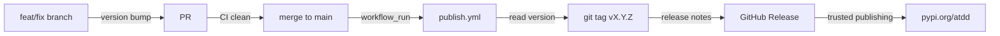

# Release & publishing



`atdd init` ships workflows for validation, release publishing, and post-merge
lifecycle management. The end-to-end version protocol — where the version lives
and how it is projected into the build — is specified in
[`version-source-of-truth-design.md`](version-source-of-truth-design.md).

Configure release behavior in `.atdd/config.yaml`:

```yaml
release:
  version_file: "pyproject.toml"
  tag_prefix: "v"
```

## Post-merge

`atdd auto-phase` transitions a parent ATDD issue's phase when its PR merges.
`atdd cleanup` removes merged worktrees and orphan branches.
`atdd merge-cascade <pr1> <pr2> ...` performs a wave-ordered merge with CI
gating and update-branch loops.

## Upgrading an install

```bash
atdd upgrade    # check PyPI, upgrade (pipx/pip-aware), then sync + init --force
atdd sync       # refresh hooks, gitignore entries, exported schemas, toolkit stamp
```

`atdd sync` is not an agent-config sync, whatever the verb suggests: #1811
retired the projection that rendered a managed ATDD block into per-agent files,
and #1941 deleted the artifacts it had left behind. It takes no flags.
